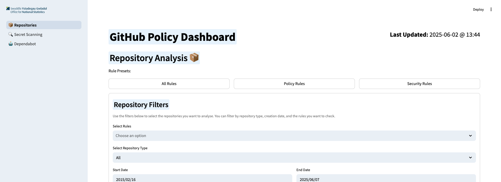
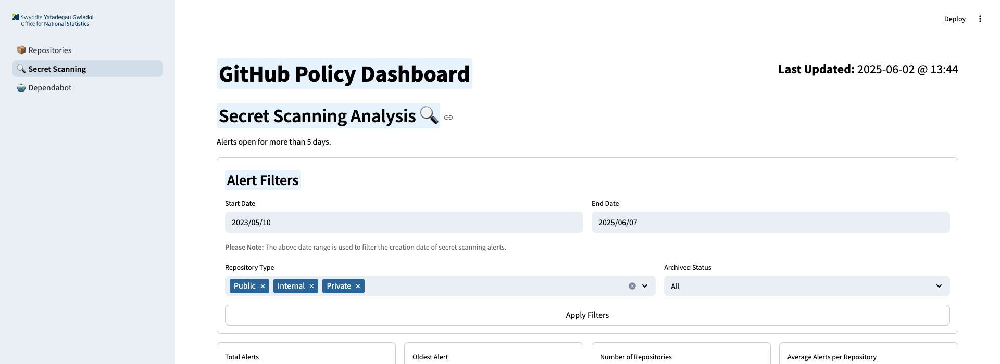
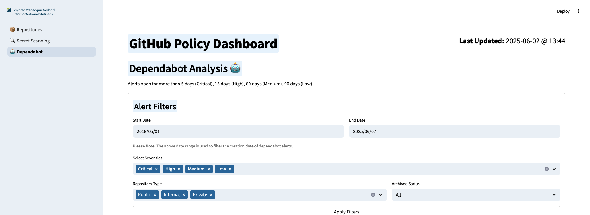
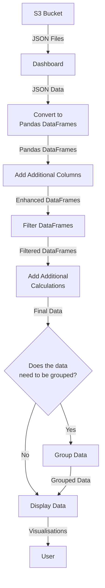

# Dashboard

## Overview

The Dashboard is a Python Streamlit application that provides the user interface for the GitHub Policy Dashboard. It is designed to display the data collected by the Data Logger and provide insights into ONSdigital's adherence to the GitHub Usage Policy.

## Features

### Repository Analysis

Displays the compliance status of repositories against the GitHub Usage Policy.

- **Filter Repositories:** Allows users to filter repositories based on a range of parameters.
- **Rule Presets:** Provides predefined sets of rules for quick compliance checks.
- **Display Rule Details:** Shows detailed information about each rule - promoting better understanding of compliance.
- **Organisation Overview:** Offers a high-level view of the organisation's compliance status, including which rule is broken the most.
- **Repository Details:** Provides detailed information about individual repositories, including their compliance status and the rules they violate.
- **Point of Contact:** Displays the point of contact for each repository, facilitating communication regarding compliance issues.

### Secret Scanning

Provides metrics on Secret Scanning alerts.

- **Filter Alerts:** Allows users to filter alerts based on a range of parameters.
- **Organisation Overview:** Offers a high-level view of the organisation's secret scanning alerts, including the oldest open alert.
- **Respository Proportion:** Displays the proportion of repositories with secret scanning alerts - allowing users to highlight the organisation's worst repositories.
- **Alert Details:** Shows information about individual alerts, promoting users to take action on them.

### Dependabot Alerts

Displays metrics on Dependabot alerts.

- **Filter Alerts:** Allows users to filter alerts based on a range of parameters.
- **Organisation Overview:** Offers a high-level view of the organisation's Dependabot alerts, including the oldest open alert and worst severity.
- **Severity Proportion:** Displays the proportion of alerts by severity, allowing users to focus on the most critical issues.
- **Repository Overview:** Provides a high-level view of the repositories with Dependabot alerts, including the number of alerts and their severity.
- **Repository Severity Proportion:** Displays the proportion of alerts by severity for each repository, allowing users to identify the most critical issues.

## Data Collection Process

The Dashboard relies on the data collected by the Data Logger, which is responsible for gathering information from GitHub repositories and storing it in a database. The Data Logger runs periodically to ensure that the Dashboard has up-to-date information.

The Dashboard collects its data from an S3 Bucket on AWS, which is populated by the Data Logger. The bucket contains JSON files for repository, Secret Scanning, and Dependabot data. The Dashboard reads these files to display the relevant information.

### Diagram of Data Flow

### Formatting and Filtering

To make the data more user-friendly, the Dashboard applies formatting and filtering to the JSON data. The processing includes:

- **Pandas DataFrames:** The JSON data is converted into Pandas DataFrames for easier manipulation and analysis.
- **Additional Columns:** New columns are added to the DataFrames to provide more context and insights, such as each repositories' visibility (See [Repository Data Collection](./repository_information.md)).
- **Filtering:** The DataFrames are filtered based on user input, allowing users to focus on specific repositories or alerts.
- **Grouping:** In areas, the initial DataFrames get grouped by repository or severity. The tool stores the grouped data in a new DataFrame so that the original DataFrame remains unchanged for further analysis.

###  Caching

In order to improve performance and reduce wait times in the frontend, the dashboard makes use of Streamlit's caching. Documentation on this is available within [Streamlit's Documentation](https://docs.streamlit.io/develop/api-reference/caching-and-state).

Each function used to collect, filter or format data likely uses the `@st.cache_data` decorator. This works by checking function parameters and if the function has already been called with those parameters, a cached output of the function will be used instead of rerunning it.

Each cached function has been given a time to live (ttl) value of an hour. This value ensures that cache is used as much as possible to improve performance, while still running the functions often enough that the data doesn't become outdated. Users are unlikely to use the dashboard for more than an hour at a time.

## Rule Logic

In order for the dashboard to provide additional information about the rules, `rulemap.json` is used. More information about this file can be found in [Rule Mapping](./rulemap.md), including how to add new rules and changing the presets.
