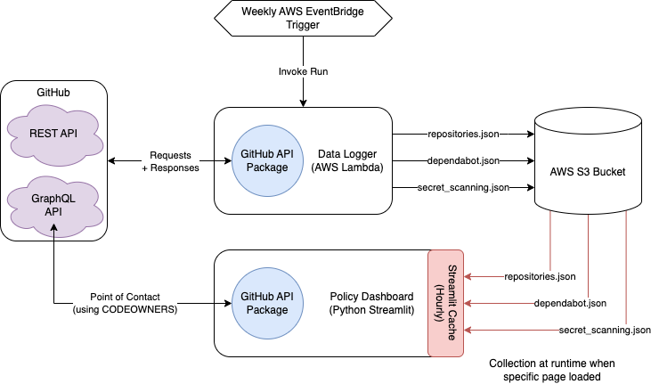

#  GitHub Policy Dashboard

## Overview

The GitHub Policy Dashboard is a tool designed to monitor ONS' adherence to the GitHub Usage Policy. The Dashboard provides insights into 3 main areas:

- Repository Compliance
- Secret Scanning Alert Metrics
- Dependabot Alert Metrics

The dashboard is used as a part of the ONSdigital audit process to ensure compliance and security across the GitHub Organisation.

## Scope

The dashboard provides a utility to capture the state of ONSdigital at a given point in time. The dashboard is not intended to be a live monitoring tool, but rather a snapshot of the current state of the ONSdigital GitHub Organisation.

The information provided by the dashboard is intended to be used as a guide for ONSdigital teams to ensure compliance with the GitHub Usage Policy. The dashboard is not intended to be a comprehensive security tool, but rather a tool to help teams identify areas for improvement, GitHub Owners and Administrators to encourage improvement and to provide stakeholders with assurance that ONSdigital is adhering to the GitHub Usage Policy.

## Architecture

The GitHub Policy Dashboard is built using the following components:

- Policy Dashboard: A Python Streamlit application that provides the user interface for the dashboard.
- Data Logger: An AWS Lambda function that collects data from the GitHub API and stores it in an S3 bucket. This collects the data required for the dashboard to function.

The below diagram illustrates the architecture of the GitHub Policy Dashboard and how the components interact with each other.

## Getting Started

Getting started guides are available in the project's READMEs:

- [Policy Dashboard](https://github.com/ONS-Innovation/github-policy-dashboard/blob/main/README.md)
- [Data Logger](https://github.com/ONS-Innovation/github-policy-dashboard/blob/main/data_logger/README.md)

## Additional Information

For more information about each service, please refer to their individual documentation pages:

- [Policy Dashboard](./dashboard/index.md)
- [Data Logger](./data_logger/index.md)
