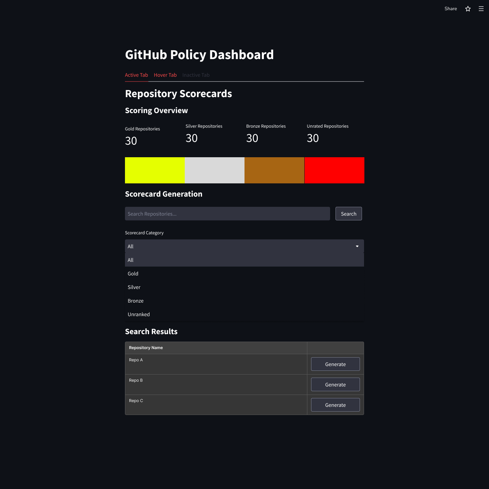
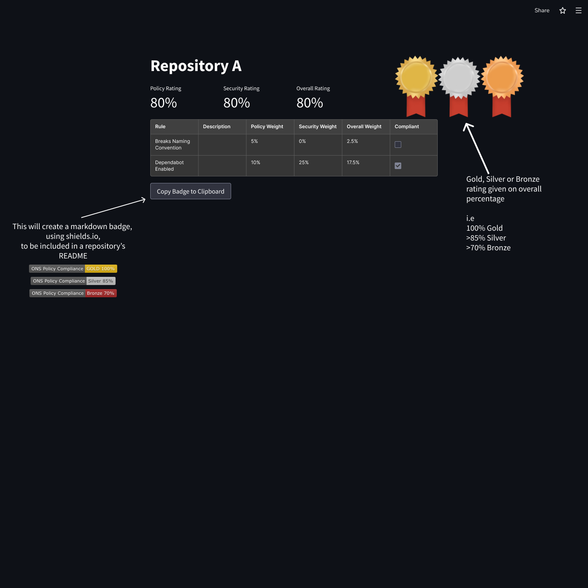

# Scorecard Designs

Below are some screen designs for the scorecarding system which will be created. A user will navigate to the [Scorecard Generation page](#scorecard-generation) and search for a repository. They will then click on the "Generate" button for the repository of choice to create a scorecard. The user will be redirected to the [Scorecard](#scorecard) where they can see the scores for the chosen repository. On this screen, there will be a button to generate a README badge, using Shields.io, which the user can include in the chosen repository's README.

## Scorecard Generation

## Scorecard

